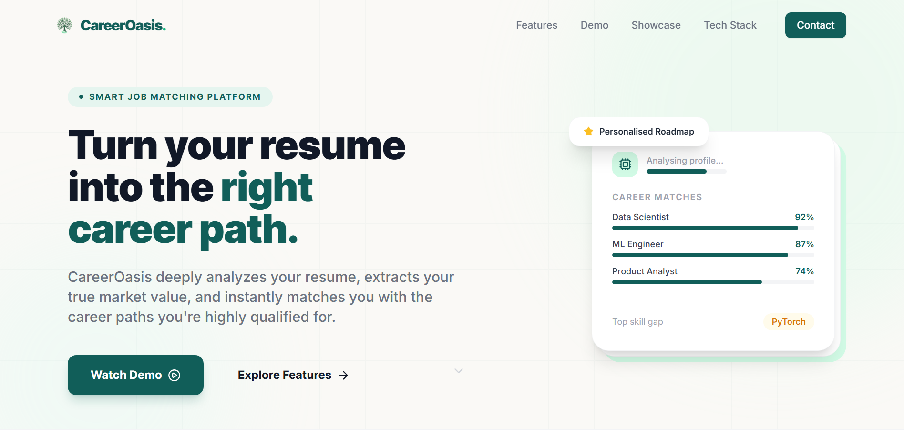

# 🌿 CareerOasis Portfolio

<p align="center">
  
</p>

A modern frontend portfolio showcasing the design and user experience of **CareerOasis** — an AI-powered career guidance platform.

🔗 **Live Demo:** https://gee0410.github.io/CareerOasis_Portfolio/

---

##  Highlights

*  Clean and modern SaaS-inspired interface
*  Fully responsive across desktop and mobile devices
*  Smooth animations powered by Framer Motion
*  Component-based architecture with reusable UI elements
*  Automatically deployed to GitHub Pages via GitHub Actions

---

##  Built With

* React
* Vite
* Tailwind CSS
* Framer Motion
* Lucide React

---

##  Purpose

This repository focuses exclusively on the **portfolio and presentation layer** of CareerOasis, demonstrating the project's visual identity, frontend implementation, and overall user experience.

For the complete application, including backend services and AI-powered features, please refer to the main CareerOasis system repository.

---

##  Run Locally

```bash
npm install
npm run dev
```

Build for production:

```bash
npm run build
```
